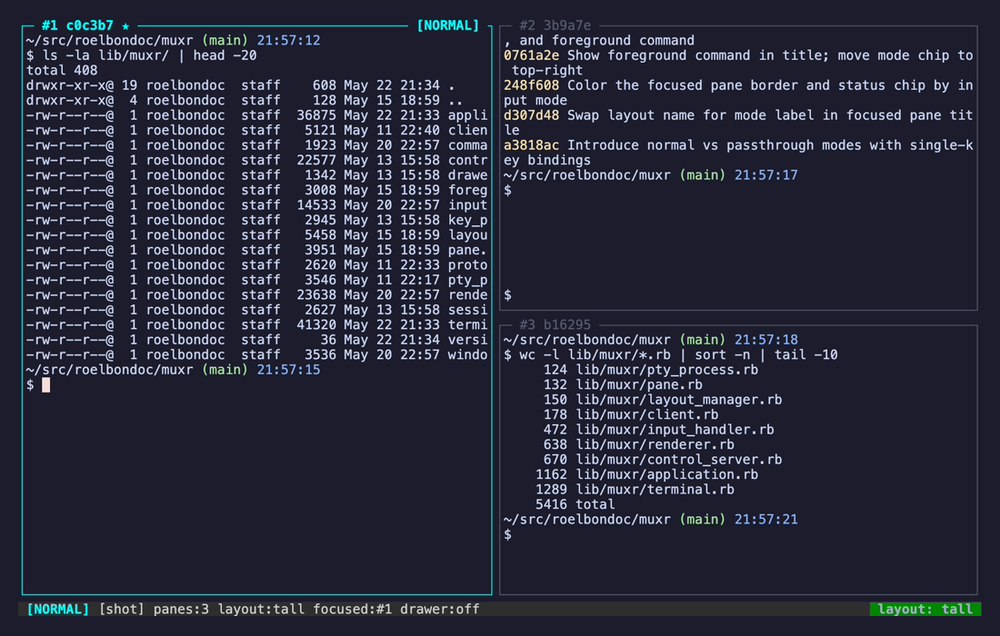
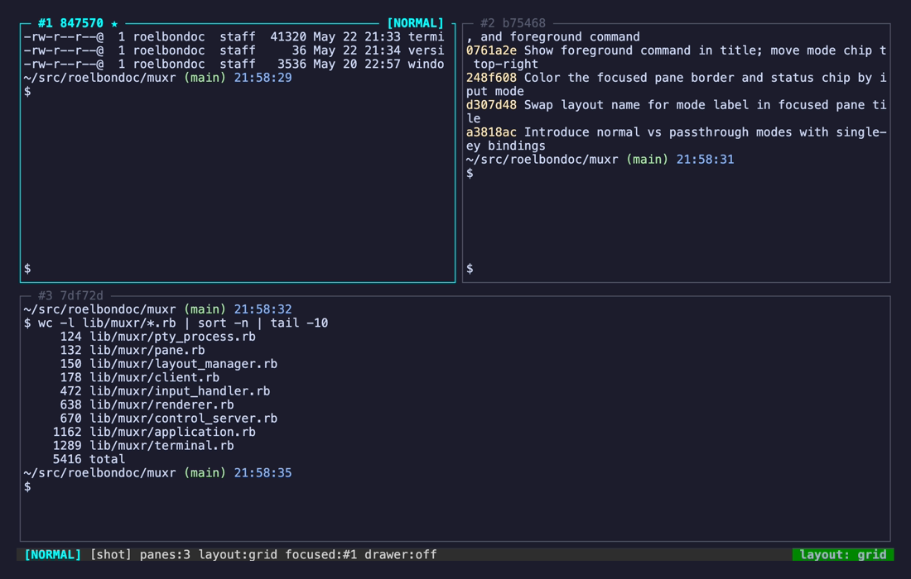
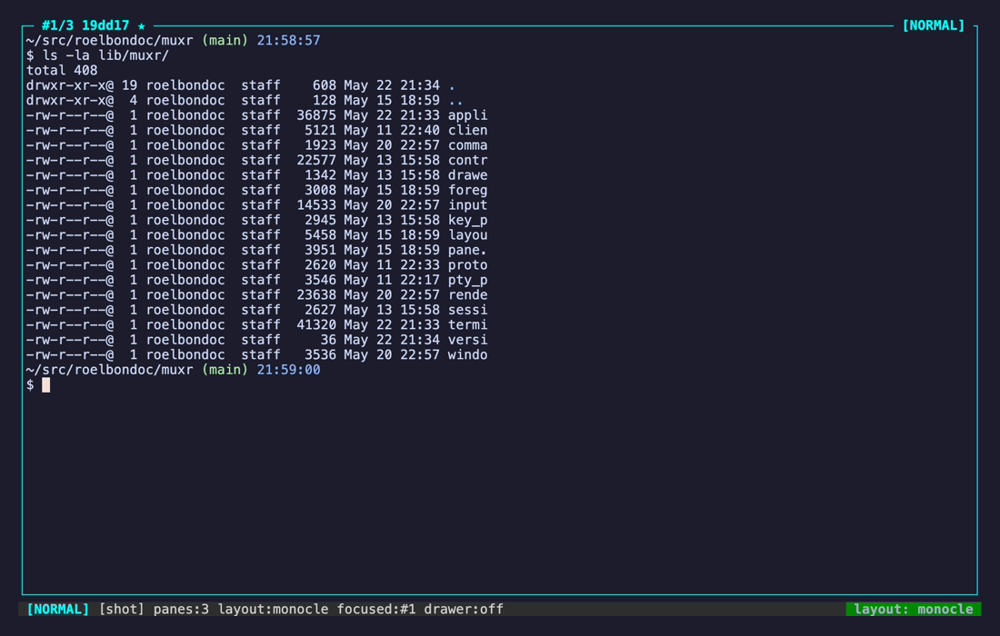
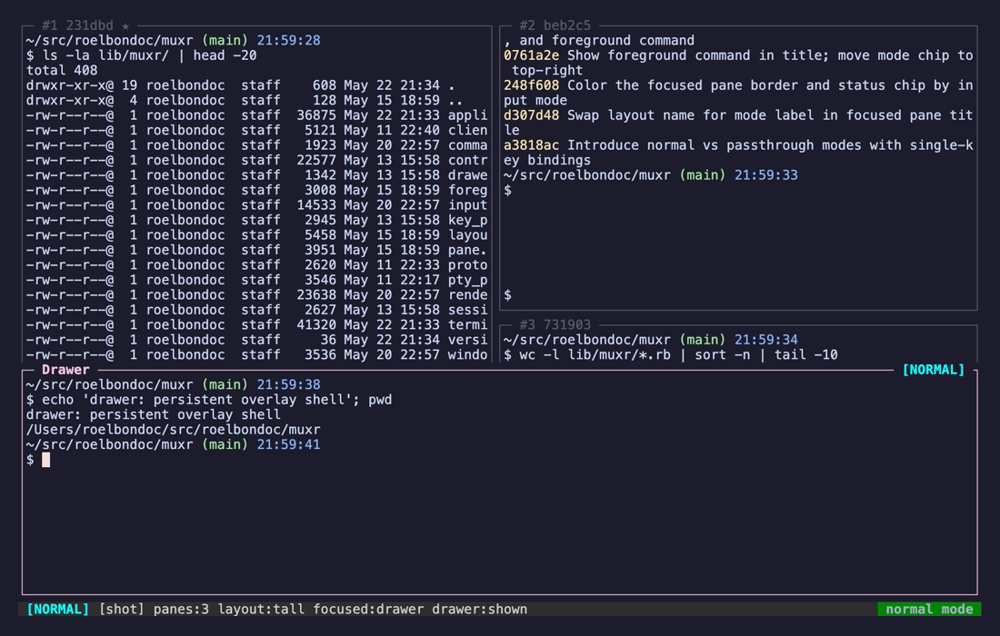

# muxr

A keyboard-driven terminal multiplexer in pure Ruby. `muxr` (Ruby + Unix)
combines the familiar keybindings of **GNU Screen**, the automatic tiling
of **xmonad**, and a **Quake-style drop-down drawer**. Panes are treated
like tiling-window-manager clients — you never resize them by hand;
the active layout decides geometry.

```
┌─ #1 a3f9b2 ★ · npm test ──── [NORMAL] ─┬─ #2 c2e810 ──────────────┐
│ master pane (running npm test)         │ stacked slave pane       │
│                                        │                          │
│                                        ├──────────────────────────┤
│                                        │ #3 9b1d04 [P]            │
│                                        │ private pane (MCP-hidden)│
└────────────────────────────────────────┴──────────────────────────┘
┌ Drawer ────────────────────────────────────────────────────────────┐
│ persistent overlay shell, opens from the bottom                    │
└────────────────────────────────────────────────────────────────────┘
 [NORMAL] [default] panes:3 layout:tall focused:#1 drawer:shown   muxr ^a ?
```

Each pane shows its slot (`#1`, `#2`, …) plus a stable 6-hex id
(`a3f9b2`). The slot is positional and shifts when panes are created,
killed, or promoted; the id is generated once and survives layout
changes, detach/reattach, and cold-restart from the session JSON. `[P]`
marks a private pane that the MCP control surface refuses to read or
drive (see [MCP control surface](#mcp-control-surface) below). The
focused pane's title shows the foreground command running in its PTY
(e.g. `· npm test`) when something other than the shell is in the
foreground, and the `[NORMAL]` chip in the top-right corner — along
with the border color — tracks the current [input mode](#modes).

## Screenshots

The three built-in layouts (pick directly with `t`/`g`/`m` in normal mode, or cycle with `Tab` / `C-a Tab`):

<table>
  <tr>
    <td align="center"><strong>tall</strong><br/>master + stacked slaves</td>
    <td align="center"><strong>grid</strong><br/>even tiling</td>
    <td align="center"><strong>monocle</strong><br/>focused pane fullscreen</td>
  </tr>
  <tr>
    <td></td>
    <td></td>
    <td></td>
  </tr>
</table>

The Quake-style drawer overlay (`~` in normal mode, `C-a ~` in passthrough):



## Install / run

```bash
gem install muxr
muxr                     # attach the "default" session (auto-spawn if needed)
muxr work                # attach (or start) a named session
muxr --list              # list running sessions and exit
muxr --install-skill     # install the MCP skill into ~/.claude/skills
muxr --help
```

Requires **Ruby ≥ 3.4**. No runtime gems — just `PTY`, `IO.console`, `JSON`,
`Socket`, and `FileUtils` from stdlib.

`muxr` is the client. The first invocation for a session daemonizes a
server in the background; subsequent invocations attach to it over a Unix
socket. `d` (normal mode) / `C-a d` (passthrough) detaches the client
and leaves the server (and every shell it owns) running, so reattaching
gives you back the exact same panes with their full history.

### From source

To run the latest unreleased code or hack on muxr locally, clone the repo
and use `bin/muxr` directly — it puts `lib/` on `$LOAD_PATH` itself:

```bash
git clone https://github.com/roelbondoc/muxr
cd muxr
bin/muxr                 # same flags as the installed `muxr` executable
```

## Modes

muxr has two top-level input modes, modeled on vim:

- **Normal** (default at startup) — single keys act on the multiplexer.
  `hjkl` moves focus between panes, `HJKL` moves the focused pane
  itself, `c`/`x` create/close panes, `t`/`g`/`m` set the layout, etc.
  No prefix needed.
- **Passthrough** (entered with `i`) — every keystroke is forwarded to
  the focused pane, exactly like a regular terminal. muxr commands are
  reached via the historical `Ctrl-a` prefix. `Ctrl-a Esc` returns to
  normal mode.

The active mode appears as a `[MODE]` chip in the top-right corner of
the focused pane (and the leftmost slot of the status bar). The
focused pane's border is colored by mode — cyan for normal, green for
passthrough, orange for scrollback (and its `/` search prompt),
magenta for selection, yellow for the command prompt, red during the
kill-session or close-pane confirmation, blue while help is open.
Unfocused panes always render with the grey unfocused border,
regardless of mode.

### Normal mode

| Keys                 | Action                                              |
|----------------------|-----------------------------------------------------|
| `h` / `j` / `k` / `l`| focus pane left / down / up / right (spatial)       |
| `H` / `J` / `K` / `L`| move focused pane left / down / up / right          |
| `i`                  | drop into passthrough mode                          |
| `c` / `x`            | new / close focused pane (close asks `y/n`)         |
| `t` / `g` / `m`      | layout: tall / grid / monocle                       |
| `Tab` / `Enter`      | cycle layout / promote focused to master            |
| `a` / `1` … `9`      | toggle last pane / jump to pane by number           |
| `s`                  | enter scrollback / copy-mode                        |
| `~` / `C` / `P`      | drawer / Claude drawer / toggle private flag        |
| `]`                  | paste internal yank buffer into focused pane        |
| `:` / `?`            | command prompt / help                               |
| `d` / `q`            | detach / kill session (asks `y/n`)                  |

`h`/`j`/`k`/`l` does true spatial navigation — it inspects the current
layout's rectangles and picks the closest neighbor in the requested
direction. In monocle (where every pane occupies the full area) it
falls back to linear next/previous so the keys still do something
useful.

`H`/`J`/`K`/`L` swap the focused pane with the spatial neighbor in
that direction, then keep focus on the moved pane so you can keep
dragging it. Swapping into position 0 of `tall`/`grid` promotes the
pane to master (the layout master is always `panes[0]`). In monocle
the move falls back to linear next/prev shuffling.

### Passthrough mode (`Ctrl-a` prefix)

| Keys           | Action                                                  |
|----------------|---------------------------------------------------------|
| `C-a Esc`      | return to normal mode                                   |
| `C-a c`        | new pane                                                |
| `C-a n` / `p`  | focus next / previous pane (linear)                     |
| `C-a a`        | toggle last (previously focused) pane                   |
| `C-a 1` … `9`  | jump to pane by its label                               |
| `C-a x`        | close focused pane (asks `y/n`; hides drawer with no prompt) |
| `C-a Tab`      | cycle layout (`tall` → `grid` → `monocle`)              |
| `C-a Enter`    | promote focused pane to master                          |
| `C-a ~`        | toggle drawer (shell)                                   |
| `C-a C`        | toggle Claude Code drawer (MCP-aware)                   |
| `C-a P`        | toggle private flag on focused pane (hides from MCP)    |
| `C-a [`        | enter scrollback / copy-mode                            |
| `C-a ]`        | paste internal yank buffer into focused pane            |
| `C-a d`        | detach (server keeps running)                           |
| `C-a q`        | kill session (asks `kill session? (y/n)`)               |
| `C-a :`        | command prompt                                          |
| `C-a ?`        | help                                                    |
| `C-a C-a`      | send literal `C-a` to focused pane                      |

### Scrollback and copy-mode

Each pane keeps a bounded (5000-row) scrollback ring. `s` in normal
mode (or `C-a [` in passthrough) enters scrollback with vi-style
navigation; the status bar shows a key hint and the pane title gains
`[scrollback N/M]`.

| Keys                    | Action                              |
|-------------------------|-------------------------------------|
| `j` / `k` or `↓` / `↑`  | scroll one line                     |
| `d` / `u` (or `C-d`/`C-u`, `PgDn`/`PgUp`) | half page             |
| `f` / Space (or `C-f`/`C-b`) | full page                      |
| `g` / `G` (or `Home` / `End`) | top / bottom                  |
| `/` *query* `Enter`     | search forward (toward newer); `?` searches backward |
| `n` / `N`               | next / previous match in the search direction (wraps) |
| `q` / `Esc` / `C-c`     | exit back to normal mode            |

Search uses smart-case (case-insensitive unless the query has an
uppercase letter), scans both scrollback and the live buffer, and
centers the chosen match in the viewport. Matches stay highlighted in
yellow while you're in scrollback; exiting clears the highlight.

Press `v` inside scrollback to enter a movable-cursor selection mode.
Vim-style motions are supported:

| Keys                    | Action                              |
|-------------------------|-------------------------------------|
| `h` / `j` / `k` / `l`   | left / down / up / right            |
| `0` / `^` / `$`         | line start / first non-blank / line end |
| `w` / `W`               | next word / WORD start              |
| `e` / `E`               | next word / WORD end                |
| `b` / `B`               | previous word / WORD start          |
| `g` / `G`               | top / bottom of timeline            |
| `H` / `M` / `L`         | top / middle / bottom of viewport   |
| `C-d`/`C-u`, `C-f`/`C-b`, Space | half / full page             |
| `v` / `C-v`             | anchor char / block selection (toggle) |
| `y` or Enter            | yank and return to normal mode      |
| `q` / `Esc` / `C-c`     | cancel back to scrollback           |

`v` and `C-v` toggle between character and block (rectangular) selection
— switching between the two preserves the anchor. `y` or Enter yanks the
selection into an internal buffer, pipes it to `pbcopy` in the background
(silent no-op when `pbcopy` is unavailable), and returns to normal mode.
`]` (normal) / `C-a ]` (passthrough) writes the yank buffer back into the
focused pane.

## Commands (typed after `:` in normal mode, or `C-a :` in passthrough)

```
layout {tall|grid|monocle}     # also: layout (no arg) → cycle
drawer {toggle|show|hide|reset}
claude                         # toggle the Claude Code drawer
private                        # toggle private flag on focused pane
save                           # persist session to ~/.muxr/sessions/<name>.json
restore                        # show path to saved session
sessions | ls                  # list saved sessions
new | close | next | prev | master
detach | quit                  # quit asks for y/n confirmation
```

## MCP control surface

muxr exposes a second listener at `~/.muxr/sockets/<name>.ctrl.sock`
that accepts multiple concurrent NDJSON clients over a small JSON-RPC
surface (`session.get`, `panes.list`, `pane.read`, `pane.send_input`,
`pane.run`, `pane.subscribe`, `pane.kill`, `layout.set`, `drawer.*`,
…). The control socket is independent of TTY attach — programmatic
clients never count as "attached", so a Claude Code session and a human
can drive the multiplexer concurrently.

`pane.run` waits for the PTY to go idle before responding: it sends the
input, polls for output, and returns once no bytes have arrived for
`idle_ms` (default 500). Server-side idle detection avoids the
send-then-poll race that plagues naive client-side automation.

`pane.send_input`, `pane.run`, and `drawer.send_input` accept a `keys`
array of vim-style `<name>` tokens (`<esc>`, `<c-c>`, `<cr>`, arrows,
etc.) interleaved with literal text — callers don't have to remember
that Escape is `"\e"` and Ctrl-C is `"\x03"`. Bracketed-paste wrapping
still applies to literal segments only.

### Claude Code integration

```bash
muxr --install-skill            # copies skills/muxr-control into ~/.claude/skills
                                # and prints the `claude mcp add` registration line
```

`bin/muxr-mcp` is the standalone MCP-over-stdio bridge that translates
Claude Code tool calls into NDJSON requests on the control socket. It
auto-detects the target session from `MUXR_CONTROL_SOCKET` or
`MUXR_SESSION` env vars.

`C` (normal) / `C-a C` (passthrough) / `:claude` opens a drawer whose shell is `claude`, with
`MUXR_SESSION`, `MUXR_CONTROL_SOCKET`, `MUXR_FOCUSED_PANE`, and
`MUXR_DRAWER_SELF=1` injected into its environment. The bridge picks
those up automatically; you get a Quake-style Claude Code overlay that
already knows what session it's in. `MUXR_DRAWER_SELF` makes the bridge
refuse `drawer.*` methods, so a claude drawer can't recurse into its
own PTY.

### Private panes

`P` (normal) / `C-a P` (passthrough) / `:private` flips the private flag on the focused pane.
Private panes are hidden from programmatic callers: `panes.list` strips
cwd/rows/cols, and `pane.read`, `pane.send_input`, `pane.run`,
`pane.subscribe`, and `pane.kill` refuse with an error message pointing
the human at the TTY (`P` / `C-a P`) to expose it. The flag is persisted in session
JSON and shown as `[P]` in the pane title bar. The MCP surface
intentionally has no method to flip the flag — only a human at the TTY
can mark a pane public again.

## Architecture

muxr runs as **two processes** that talk over a Unix domain socket at
`~/.muxr/sockets/<name>.sock`. The server owns the PTYs and all session
state; the client is a thin TTY front-end that comes and goes across
detach/reattach.

```
Client (foreground, owns the TTY)              Server (daemon, owns the PTYs)
 ├─ STDIN in raw mode + alt screen              Application (event loop, lifecycle)
 ├─ SIGWINCH → RESIZE frame                      ├─ Session ─ Window ─ Pane[ ] ─ Terminal + PTYProcess
 │                                               │      └─ Drawer ─ Pane
 └─ Protocol                                     ├─ Renderer        – diff-emits ANSI as OUTPUT frames
     ◄── OUTPUT bytes ──── Renderer ◄────────────┤   InputHandler    – normal/passthrough mode state machine
     ──── INPUT bytes ───► InputHandler          ├─ CommandDispatcher – parses ":"-prefixed commands
     ──── HELLO/RESIZE ──► apply_size            ├─ LayoutManager    – pure (layout, count, area) → [Rect]
     ◄── BYE ───────────── disconnect_client     ├─ UNIXServer (TTY socket, one client at a time)
                                                 └─ UNIXServer (.ctrl.sock, many NDJSON clients)
```

Frames are length-prefixed (`[1-byte type][4-byte BE length][payload]`):
`H` hello, `I` input, `R` resize, `B` bye, `O` output.

A second listener at `~/.muxr/sockets/<name>.ctrl.sock` accepts
multiple concurrent NDJSON clients for the MCP control surface (see
above). The two sockets are independent — programmatic clients never
count as "attached", so they don't lock out the human's TTY client.

The server's event loop is single-threaded `IO.select` over the
listening sockets, the attached client (when present), every pane PTY,
the drawer PTY, and every connected control client. A single
background thread polls each pane's foreground process group every
750ms (`/proc/<pid>/stat` on Linux, `ps -o tpgid=,pgid=` on macOS) so
the `· cmd` annotation in the pane title can refresh without blocking
the render loop. Everything else stays on the main thread. Layouts
are pure — `LayoutManager` has no mutable state, so the renderer
recomputes geometry on every tick after a resize or pane add/remove
without bookkeeping.

`d` (normal) / `C-a d` (passthrough) detaches the client but leaves
the server (and its shells) running; reattaching gives you back the
same panes with their full history. `q` / `C-a q` / `:quit` flash
`kill session? (y/n)` in the status bar and only tear the server down
on `y` — there is no "kill without confirm" keybinding by design.

The drawer's PTY is **never torn down** when the drawer is hidden — its
shell process keeps running so the next toggle restores the previous
session. Its initial working directory is inherited from whatever pane
was focused when the drawer was first created; only `drawer reset` kills
the PTY.

The per-pane `Terminal` is a real VT100 emulator (cursor movement, SGR
including 256-color/truecolor and underline subparameters, erase/insert/
delete, autowrap, scroll regions). Scrollback is composited into the
visible grid through a view-offset that auto-tracks new rows while
scrolled back, so reviewed content stays frozen.

## Session persistence

Sessions live in `~/.muxr/sessions/<name>.json`:

```json
{
  "name": "default",
  "layout": "tall",
  "focused_index": 0,
  "master_index": 0,
  "panes":  [
    {"id": "a3f9b2", "cwd": "/home/me/code", "private": false},
    {"id": "c2e810", "cwd": "/tmp", "private": true}
  ],
  "drawer": {"visible": true, "cwd": "/home/me/code"}
}
```

Pane ids and the private flag are persisted, so the same ids survive
cold-restart from the JSON snapshot and a pane that was marked private
stays private.

The JSON file is mainly a **cold-storage fallback**. Between detaches the
live session lives inside the running server process, so `d` (normal) /
`C-a d` (passthrough) then `bin/muxr <name>` reattaches to the exact
same shells with their full history. The JSON only matters once the
server is gone (after `q` / `C-a q` or a reboot): re-launching
`muxr <name>` rebuilds pane and drawer shells
using the saved working directories. Shell command history within those
panes is **not** persisted — that's the job of your shell's own history
file. Run `:save` from inside muxr to write the snapshot.

## Development

```bash
bundle install      # only minitest and rake
rake test           # full suite (200+ unit tests)

# Run a single file or test
ruby -Ilib -Itest test/test_layout_manager.rb
ruby -Ilib -Itest test/test_terminal.rb -n test_csi_cursor_position
```

Tests cover the layout algorithms (including spatial neighbor lookup
for `hjkl`), drawer state machine, window pane ordering, session JSON
round-trip, the client/server framing protocol, the input-handler
state machine (normal/passthrough mode transitions, scrollback,
selection), foreground-command parsing (Linux `/proc` stat format and
shell-filter rules), the renderer's diff-emit, and the VT100
emulator's cursor movement, SGR (including colon-subparameter and
underline-color forms), erase, scroll-region, and autowrap handling.
PTY-dependent code paths are exercised via dependency injection so
tests don't spawn shells.

On-disk layout:

```
~/.muxr/
 ├─ sessions/<name>.json        structural snapshot written by `:save`
 ├─ sockets/<name>.sock         TTY client listener (auto-managed)
 ├─ sockets/<name>.ctrl.sock    MCP control listener (auto-managed)
 └─ logs/<name>.log             server stdout/stderr
```

### Regenerating the README screenshots

The PNGs under `docs/screenshots/` are produced by [`vhs`](https://github.com/charmbracelet/vhs)
driving muxr itself — one `.tape` file per screenshot under
`docs/screenshots/tapes/`. After a UI change, refresh them with:

```bash
brew install vhs                       # one-time
docs/screenshots/tapes/regenerate.sh   # renders all four
```

Each tape spawns a throwaway `shot` session, populates three panes with
`ls`/`git log`/`wc` output, sets the layout, and writes a single PNG via
`Screenshot`. Tweak the tape if the keybindings or status bar change.

## Contributing

Contributions are welcome from anyone, with one requirement: **the code
must be generated by a frontier LLM** (e.g. Claude, GPT, Gemini at their
current top-tier model). Hand-written patches will not be accepted.

When you open a PR, please:

- State which model produced the change in the PR description.
- Include the prompt(s) you used, or a short summary of the conversation
  that produced the diff.
- Drive the model yourself — review, push back, iterate. You are
  responsible for the patch: it should pass `rake test`, follow the
  conventions in `CLAUDE.md`, and not regress existing behavior.

Bug reports, feature requests, and design discussion in issues are
welcome regardless of how they're written.
