<h1 align="center">muxr</h1>

<p align="center">
  <strong>A keyboard-driven terminal multiplexer in pure Ruby.</strong><br/>
  GNU Screen's keybindings · xmonad's automatic tiling · a Quake-style drop-down drawer
</p>

<p align="center">
  <a href="https://rubygems.org/gems/muxr"></a>
  
  
  <a href="LICENSE.txt"></a>
</p>

<p align="center">
  <a href="https://roelbondoc.github.io/muxr/">Project page</a> ·
  <a href="#install">Install</a> ·
  <a href="#layouts">Layouts</a> ·
  <a href="#keybindings">Keybindings</a> ·
  <a href="#claude-code-integration">Claude Code</a> ·
  <a href="CHANGELOG.md">Changelog</a>
</p>

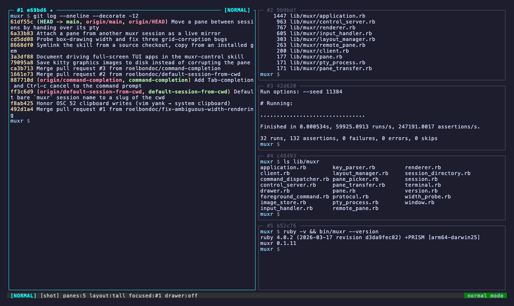

muxr treats panes the way a tiling window manager treats windows: you never
drag a divider or resize a split by hand. You say *how many panes* and *which
layout*, and the geometry follows. Everything else — the VT100 emulator, the
protocol, the tiling maths — is stdlib Ruby with no runtime gems.

## Highlights

|   | |
|---|---|
| **Ten automatic layouts** | tall, wide, columns, rows, grid, spiral, centered, stack, monocle, auto — each a pure function of pane count and screen size |
| **Two input modes** | *normal* acts on the multiplexer with single keys; *passthrough* forwards everything to the shell behind the classic `Ctrl-a` prefix |
| **Detach and reattach** | the server keeps every PTY alive; reattaching gives you back the same shells with full history |
| **Quake-style drawer** | a persistent overlay shell that drops from the top of the screen and never loses its scrollback |
| **Real terminal emulation** | truecolor SGR, scroll regions, alternate screen, bracketed paste, wide/CJK/emoji cells, OSC 8 hyperlinks |
| **Scrollback with vi motions** | 50,000-row ring per pane, `/` search with smart-case, character and block visual selection, yank to the system clipboard |
| **Panes across sessions** | borrow a live pane from another muxr session, or hand it over for good by passing its pty file descriptor down a socket |
| **Built for agents** | a JSON-RPC control socket, an MCP bridge, and private panes that programmatic callers cannot see or touch |

## Install

```bash
gem install muxr
```

Requires **Ruby ≥ 3.4**. There are no runtime gem dependencies — muxr uses
only `PTY`, `IO.console`, `Socket`, `JSON`, `Zlib`, and `FileUtils` from
stdlib.

```bash
muxr                     # attach the session for the current directory
muxr work                # attach (or start) a session named "work"
muxr --list              # list running sessions and exit
muxr --install-skill     # install the Claude Code skill + MCP bridge
muxr --help
```

`muxr` is the client. The first invocation for a session daemonizes a server
in the background; later invocations attach to it over a Unix socket. With no
arguments the session is named after the current directory, so running `muxr`
in a project always lands you back in that project's session.

### From source

```bash
git clone https://github.com/roelbondoc/muxr
cd muxr
bin/muxr                 # same flags as the installed executable
```

`bin/muxr` puts `lib/` on `$LOAD_PATH` itself — no `-I` and no bundler needed
to run it.

## A 60-second tour

Start muxr and you are in **normal mode**, where single keys drive the
multiplexer:

```
c c c        three more panes
t            tall layout — master left, the rest stacked right
l  j  k      move focus around spatially
J            drag the focused pane down past its neighbour
Enter        promote the focused pane to master
i            drop into passthrough and actually use the shell
C-a Esc      back to normal mode
~            drop the drawer over everything
s  /error    scroll back and search
d            detach; `muxr` again to pick up exactly where you left off
```

Press `?` at any time for the full keymap:

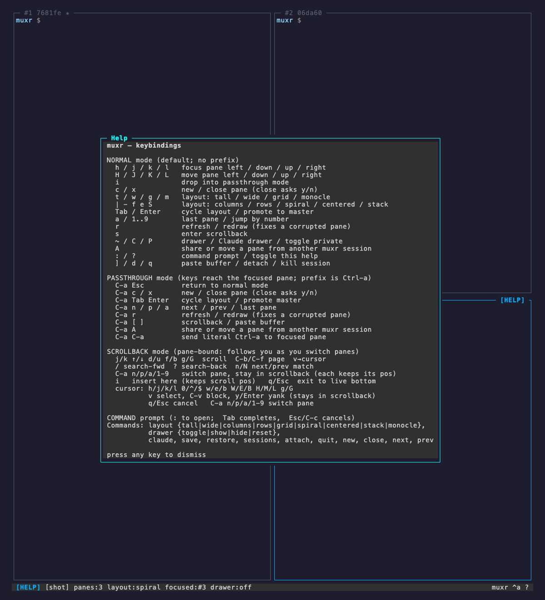

## Layouts

Layouts are pure functions of `(layout, pane count, area)`. There is no
per-pane saved geometry to drift out of sync, so adding, closing, or promoting
a pane simply recomputes the tiling on the next frame.

| Layout | Key | Geometry |
|--------|-----|----------|
| `tall`     | `t`  | master on the left, the rest stacked on the right |
| `wide`     | `w`  | master on top, the rest split across the bottom |
| `columns`  | `\|` | equal-width, full-height vertical strips |
| `rows`     | `-`  | equal-height, full-width horizontal strips |
| `grid`     | `g`  | roughly-square even tiling |
| `spiral`   | `f`  | Fibonacci spiral winding inward — each pane half the last |
| `centered` | `e`  | master in a centred column, the rest dealt to both sides |
| `stack`    | `S`  | accordion — the focused pane expands, others collapse to title slivers |
| `monocle`  | `m`  | focused pane fullscreen |
| `auto`     | `F`  | `spiral` when the screen is at least 180×30, `stack` below that |

`Tab` cycles through them in that order. New sessions start in `auto`.

<table>
  <tr>
    <td align="center"><strong>tall</strong></td>
    <td align="center"><strong>wide</strong></td>
    <td align="center"><strong>columns</strong></td>
  </tr>
  <tr>
    <td>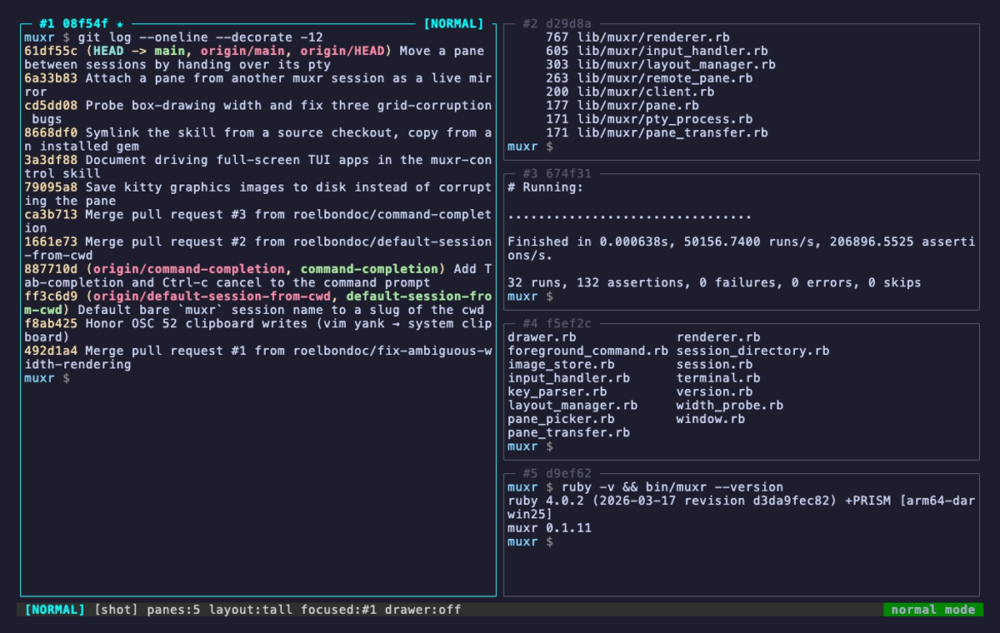</td>
    <td>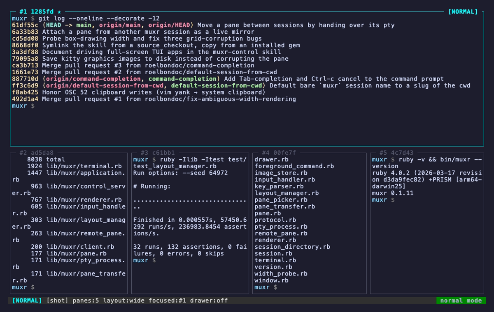</td>
    <td>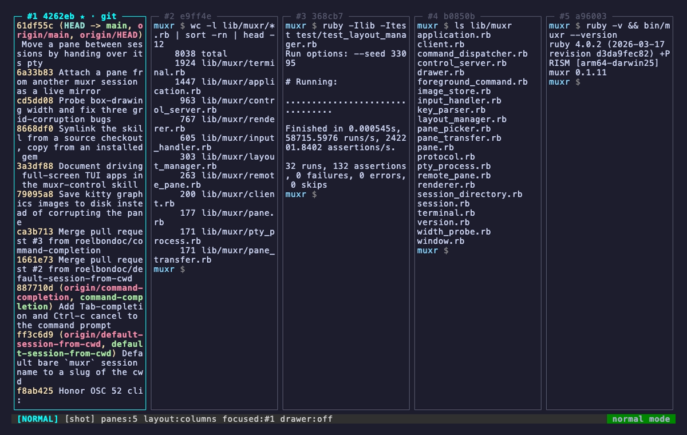</td>
  </tr>
  <tr>
    <td align="center"><strong>rows</strong></td>
    <td align="center"><strong>grid</strong></td>
    <td align="center"><strong>spiral</strong></td>
  </tr>
  <tr>
    <td>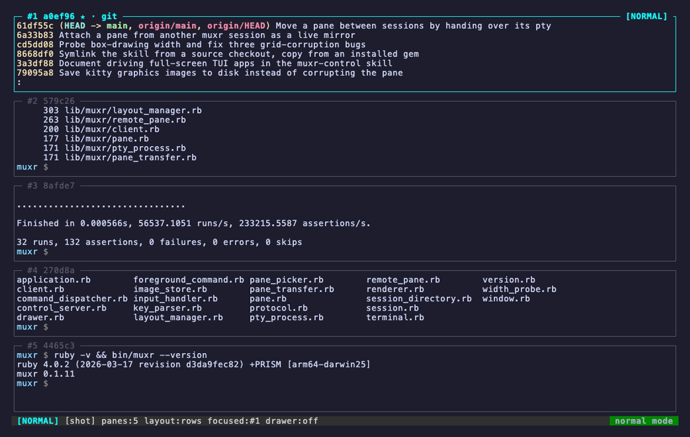</td>
    <td>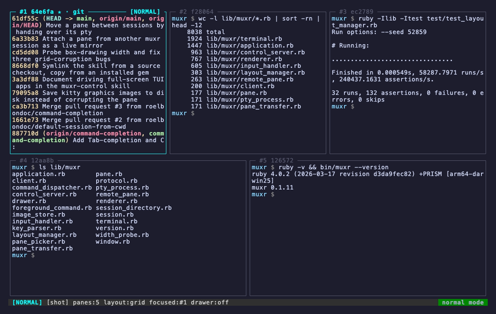</td>
    <td>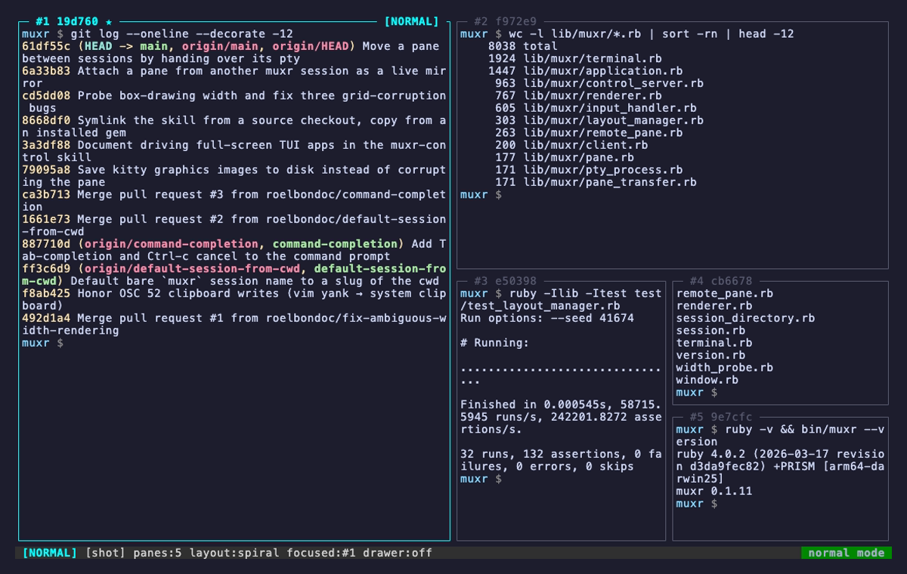</td>
  </tr>
  <tr>
    <td align="center"><strong>centered</strong></td>
    <td align="center"><strong>stack</strong></td>
    <td align="center"><strong>monocle</strong></td>
  </tr>
  <tr>
    <td>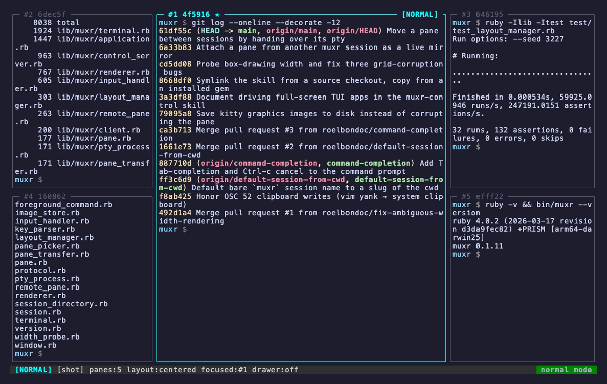</td>
    <td>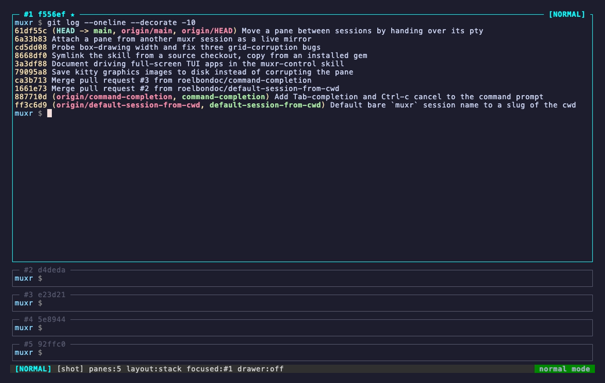</td>
    <td>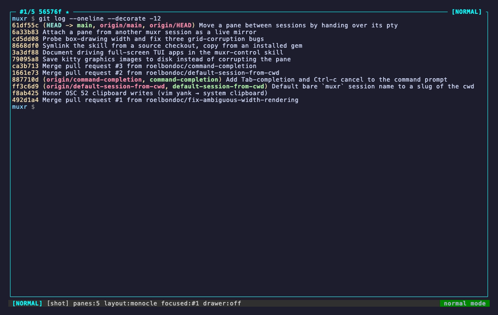</td>
  </tr>
</table>

## Reading the screen

```
┌─ #1 a3f9b2 ★ · npm test ──── [NORMAL] ─┬─ #2 c2e810 ──────────────┐
│ master pane (running npm test)         │ stacked pane             │
│                                        ├──────────────────────────┤
│                                        │ #3 9b1d04 [P]            │
│                                        │ private pane             │
└────────────────────────────────────────┴──────────────────────────┘
 [NORMAL] [work] panes:3 layout:tall focused:#1 drawer:hidden  muxr ^a ?
```

Each pane's title carries its slot (`#1`, `#2`, …) and a stable six-hex id
(`a3f9b2`). The slot is positional and shifts as panes are created, closed, or
promoted; the id is minted once and survives layout changes, detach/reattach,
a move to another session, and a cold restart from the session JSON. `★` marks
the layout master, `[P]` marks a [private pane](#private-panes), and
`@api:b338b0` marks a pane [borrowed from another session](#sharing-and-moving-panes).

When something other than the shell is in the foreground, the title shows it
(`· npm test`). A background thread polls each pane's foreground process group
roughly every 750ms so this stays current without ever blocking the render loop.

The `[MODE]` chip in the top-right corner and the focused pane's border colour
both track the current mode: **cyan** normal, **green** passthrough, **orange**
scrollback and its `/` search, **magenta** selection, **yellow** the command
prompt, **red** a `y/n` confirmation, **blue** while help is open. Unfocused
panes always use the grey border.

## Keybindings

muxr has two top-level input modes, modelled on vim.

**Normal mode** is the default at startup — single keys act on the
multiplexer, no prefix required.

| Keys | Action |
|------|--------|
| `h` `j` `k` `l` | focus pane left / down / up / right (spatial) |
| `H` `J` `K` `L` | move the focused pane left / down / up / right |
| `i` | drop into passthrough mode |
| `c` / `x` | new pane / close focused pane (asks `y/n`) |
| `t` `w` `g` `m` | layout: tall / wide / grid / monocle |
| `\|` `-` `f` `e` `S` | layout: columns / rows / spiral / centered / stack |
| `F` | layout: auto — `spiral` on a roomy screen, `stack` below the threshold |
| `Tab` / `Enter` | cycle layout / promote focused pane to master |
| `a` / `1`…`9` | toggle last pane / jump to pane by number |
| `r` | refresh — repaint the pane and nudge its program to redraw |
| `s` | enter scrollback / copy-mode |
| `~` / `C` / `P` | drawer / Claude Code drawer / toggle private flag |
| `A` | share or move in a pane from another muxr session |
| `]` | paste the internal yank buffer into the focused pane |
| `:` / `?` | command prompt / help |
| `d` / `q` | detach / kill session (asks `y/n`) |

`hjkl` is true spatial navigation: it inspects the current layout's rectangles
and picks the nearest neighbour in that direction. `HJKL` swaps the focused
pane with that neighbour and keeps focus on the moved pane, so you can keep
dragging. Swapping into slot 0 promotes the pane to master. In monocle, where
every pane owns the whole area, both fall back to linear next/previous.

**Passthrough mode** (entered with `i`) forwards every keystroke to the
focused pane, exactly like a plain terminal. muxr's own commands move behind
the historical `Ctrl-a` prefix.

| Keys | Action |
|------|--------|
| `C-a Esc` | return to normal mode |
| `C-a c` / `C-a x` | new pane / close focused pane (asks `y/n`) |
| `C-a n` / `C-a p` / `C-a a` | focus next / previous / last pane |
| `C-a 1`…`9` | jump to pane by number |
| `C-a Tab` / `C-a Enter` | cycle layout / promote to master |
| `C-a r` | refresh / redraw |
| `C-a ~` / `C-a C` / `C-a P` | drawer / Claude Code drawer / toggle private |
| `C-a A` | share or move in a pane from another session |
| `C-a [` / `C-a ]` | scrollback (or the app's own scroll) / paste yank buffer |
| `C-a d` / `C-a q` | detach / kill session (asks `y/n`) |
| `C-a :` / `C-a ?` | command prompt / help |
| `C-a C-a` | send a literal `Ctrl-a` to the focused pane |

Layouts are chosen by name from the command prompt in passthrough
(`C-a :layout grid`), or by cycling with `C-a Tab`; the single-key layout
bindings live in normal mode.

### The command prompt

`:` (normal) or `C-a :` (passthrough) opens a command line across the status
bar. `Tab` completes command names and their arguments, `Esc` or `Ctrl-c`
cancels.

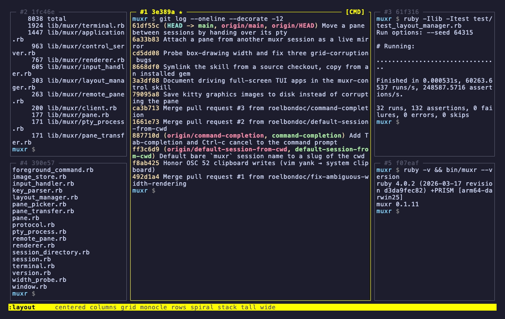

```
layout {tall|wide|columns|rows|grid|spiral|centered|stack|monocle|auto}
                       # any unambiguous prefix works (t, w, r, g, m, …);
                       # ambiguous ones (c, s) flash the candidates.
                       # `layout` with no argument cycles.
drawer {toggle|show|hide|reset}
claude                 # toggle the Claude Code drawer
private                # toggle the private flag on the focused pane
attach                 # open the pane picker (same as A)
save                   # write ~/.muxr/sessions/<name>.json
restore                # print the path to the saved session
sessions | ls          # list saved sessions and live servers
new | close | next | prev | master | detach | quit | help
```

## The drawer

`~` (normal), `C-a ~` (passthrough), or `:drawer toggle` drops a persistent
overlay shell over the top of the layout — the terminal equivalent of a Quake
console. It is the right place for the command you keep needing but do not
want to give a pane to.

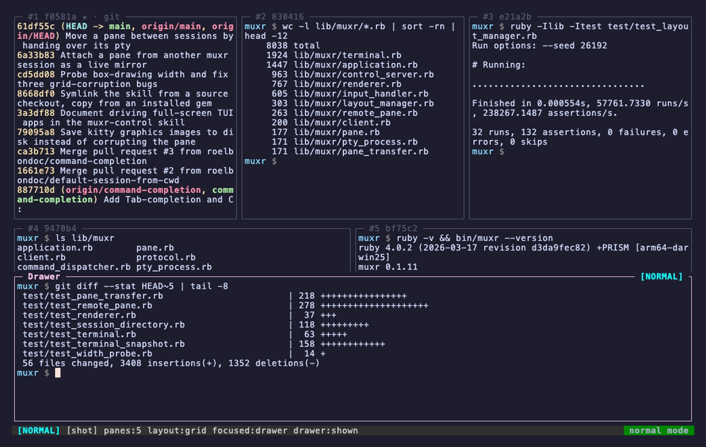

Hiding the drawer **never tears down its PTY**: the shell keeps running, so
the next toggle restores exactly what was on screen, scrollback and all. Only
`:drawer reset` kills and respawns it. Like every new pane, the drawer starts
in the session's origin directory — wherever `muxr` was first launched.

## Scrollback, search, and copy-mode

Every pane keeps a bounded scrollback ring — 50,000 rows by default, or
whatever `MUXR_SCROLLBACK` is set to when the server starts. A row costs
roughly what it printed rather than the full width of the pane, and a pane
only pays for the rows it has actually scrolled, so the default is deep enough
to stop thinking about. `s` (normal) or `C-a [` (passthrough) enters
scrollback with vi-style navigation; the pane title gains `[scrollback N/M]`
and the border turns orange.

Full-screen programs — pagers, editors, `fzf`, anything that asks for the
alternate screen — draw on a grid of their own, so paging through `less` does
not shovel its frames into your history, and quitting uncovers the screen you
started from.

| Keys | Action |
|------|--------|
| `j` `k` or `↓` `↑` | scroll one line |
| `d` `u`, `C-d` `C-u`, `PgDn` `PgUp` | half page |
| `f` `b`, `C-f` `C-b`, Space | full page |
| `g` `G`, `Home` `End` | top / bottom |
| `Tab` | switch between the app's own scroll and muxr's history |
| `/`*query*`Enter` | search forward; `?` searches backward |
| `n` / `N` | next / previous match in the search direction (wraps) |
| `v` | enter visual selection |
| `i` | drop into passthrough here, keeping your scroll position |
| `q` `Esc` `C-c` | back to normal mode at the live bottom |

### Scrolling the program instead of the history

Some programs keep their own history and want to do their own scrolling —
Claude Code, `lazygit`, `k9s`, `htop`. They say so by turning on mouse
tracking, and on such a pane the same keys drive *them* rather than muxr's
ring: muxr synthesises wheel events at the centre of the pane and writes them
straight into the pty, so scrolling reaches the program's transcript without
you touching the mouse. The mode chip reads `SCROLL:APP`. A full-screen
program that wants no mouse gets arrow keys instead, which is what makes
`less` and `vim` respond.

`Tab` switches between the two at any time — the app's own scroll, or muxr's
ring for output older than the program will page back to. `g`/`G` and search
belong to the ring, since only the program knows where its history starts.

Visual selection works in both, with one restriction. A program that scrolls
itself repaints in place, so nothing it scrolls past reaches muxr's ring, and
the ring's tail no longer continues into the top of the screen. Selection is
therefore clamped to the visible screen while you are scrolling the app; press
`Tab` first if you want to select out of muxr's history.

Search is smart-case (case-insensitive unless the query contains an uppercase
letter), scans the scrollback ring and the live buffer together, and centres
the chosen match in the viewport. A full 50,000-row ring searches in well
under a tenth of a second. Matches stay highlighted in yellow for as long as
you are in scrollback.

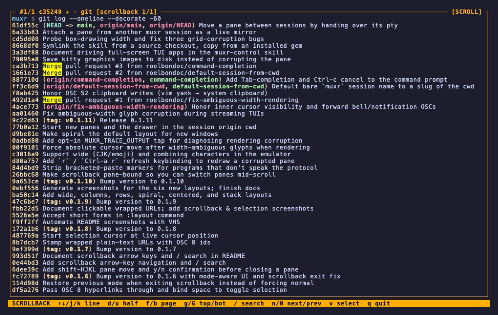

Scrollback is **pane-bound**, not modal: `C-a n` / `C-a p` / `C-a 1`…`9` work
from inside it, each pane remembers where you were reading, and returning to a
scrolled-back pane resumes there.

Press `v` for a movable-cursor selection with vim motions:

| Keys | Action |
|------|--------|
| `h` `j` `k` `l` | move the cursor |
| `0` `^` `$` | line start / first non-blank / line end |
| `w` `W` `e` `E` `b` `B` | word and WORD motions |
| `g` `G` | top / bottom of the timeline |
| `H` `M` `L` | top / middle / bottom of the viewport |
| `C-d` `C-u` `C-f` `C-b` Space | half and full page |
| `v` / `C-v` | toggle character / block (rectangular) selection |
| `y` or `Enter` | yank and stay in scrollback |
| `q` `Esc` `C-c` | cancel back to scrollback |

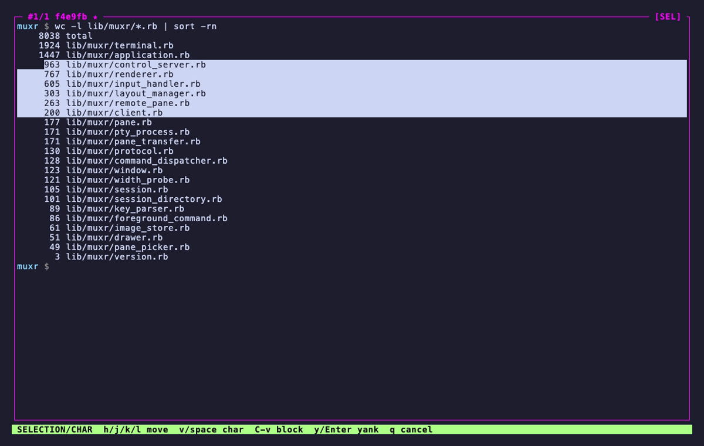

Switching between `v` and `C-v` preserves the anchor. Yanking fills muxr's
internal buffer *and* pipes the text to `pbcopy` in the background (a silent
no-op where `pbcopy` does not exist). `]` / `C-a ]` writes the buffer back
into the focused pane.

## Sharing and moving panes

`A` (or `C-a A`, or `:attach`) opens a picker listing every pane the other
muxr servers on this machine are offering, grouped by session. `j`/`k` select,
`Esc` backs out, and there are two ways to take one.

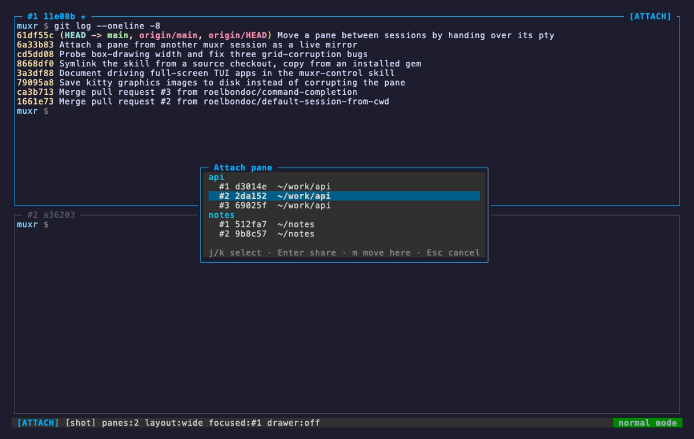

| Key | Action |
|-----|--------|
| `Enter` | **share** it — the pane lives in both sessions at once |
| `m` | **move** it here — the pane leaves the session it came from |

### Sharing

A shared pane keeps running in its own session, and both sessions show the
same live shell. Either side can type into it; colours, the alternate screen,
and full-screen TUIs all work, because what crosses between the servers is the
raw PTY byte stream rather than a screen scrape. The borrowed pane's title
names its owner: `#2 922ece @api:b338b0`.

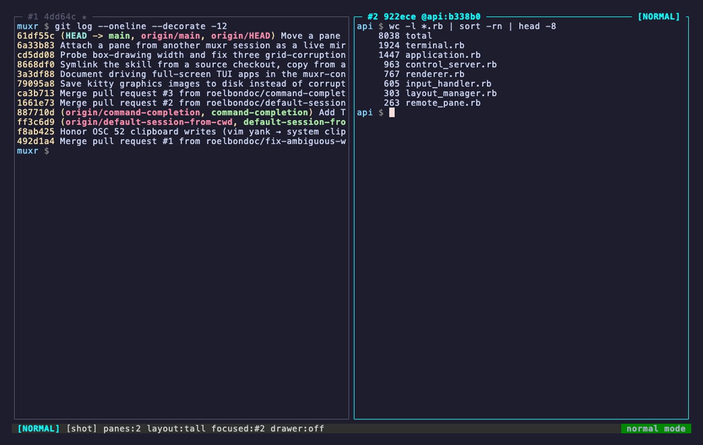

The owner keeps the PTY and remains its only reader, which settles every
question a shared pane raises:

- **Size.** The PTY runs at the smallest viewport looking at it, so it fits
  both layouts at once. Give a borrowed pane a small box and it shrinks at
  home too — exactly like tmux.
- **The owning session stops.** The mirror's socket closes and the borrower
  drops the pane on its next tick.
- **The borrowing session stops** (or you close the pane with `x`). Only the
  mirror goes away; the pane carries on at home and returns to full size the
  next time its own layout is drawn.
- **Private panes** are never offered in the picker.
- Borrowed panes are left out of `:save` — restoring one would cold-start a
  second shell in someone else's working directory.

### Moving

`m` takes the pane instead of borrowing it. The master pty **file descriptor
itself** crosses the socket, so this is a real handover rather than a
re-spawn: the same shell process keeps running, with its environment, its
background jobs, its scroll position, and everything it had on screen.
Afterwards it is an ordinary local pane that simply is not in the other
session any more.

What travels: the process, the screen, the full scrollback, the pane id, the
working directory, and the emulator's mode state (scroll region, bracketed
paste, cursor visibility, the current pen). Move a pane while it is running a
pager and both grids come with it, so quitting the pager still uncovers the
shell that was underneath.

The handover is two-phase, so a failure anywhere leaves the pane exactly where
it was rather than dropping a live shell between two servers; an abandoned
move resumes at the owner after ten seconds. Two refusals are deliberate:
muxr will not move the **last** pane out of a session (that would shut the
session down as a side effect), and a pane that is itself borrowed cannot be
moved on — move it from the session that owns it.

## Terminal fidelity

The per-pane `Terminal` is a real VT100/xterm emulator, not a line buffer: a
`rows × cols` grid of cells with a cursor, a scroll region, and a pen.

- **Colour and attributes.** 16-colour, 256-colour and truecolor SGR,
  including colon-subparameter and underline-colour forms.
- **Alternate screen.** A pager, editor or `fzf` that asks for the alternate
  screen gets a second grid to draw on, and the screen it covered is set aside
  untouched until it exits. Nothing drawn there is history, so its frames never
  enter the scrollback ring.
- **Wide and combining characters.** CJK, emoji, and zero-width marks are
  measured and stored with a continuation-cell convention, so a grid row
  containing them still lines up — including search highlights and selection.
- **Width probing.** Terminals disagree about how wide East Asian Ambiguous
  symbols (`·`, `…`, `●`, arrows) and box-drawing glyphs really are, and one
  disagreement is enough to shift the rest of a line. Rather than guess, muxr
  *measures*: on attach the client prints test glyphs and reads the cursor
  column back via DSR-CPR, then ships the verdict to the server. This is what
  keeps border-heavy TUIs — Claude Code's UI in particular — aligned.
- **Clickable links.** Plain `http`/`https`/`ftp` URLs that wrap across rows
  are re-stamped with matching OSC 8 hyperlink ids, so Ghostty, iTerm2, kitty
  and WezTerm merge the halves back into one clickable link. Program-emitted
  OSC 8 payloads are passed through untouched.
- **Clipboard passthrough.** An inner program that writes the system clipboard
  over OSC 52 (a vim yank, tmux, Ghostty) reaches `pbcopy` for real, and the
  same text lands in muxr's yank buffer.
- **Notifications.** The bell and OSC 9 / OSC 777 desktop notifications are
  forwarded out of band, from *any* pane — so "Claude finished in a background
  pane" still gets your attention.

### Images

A multiplexer that re-composites a cell grid every frame has nowhere to put
pixels, so muxr does not draw images — it saves them. When an inner program
transmits one over the kitty graphics protocol (matplotlib's kitty backend,
`timg`, `icat`, notebook TUIs), muxr decodes it into `~/.muxr/images` and
prints one line in the pane:

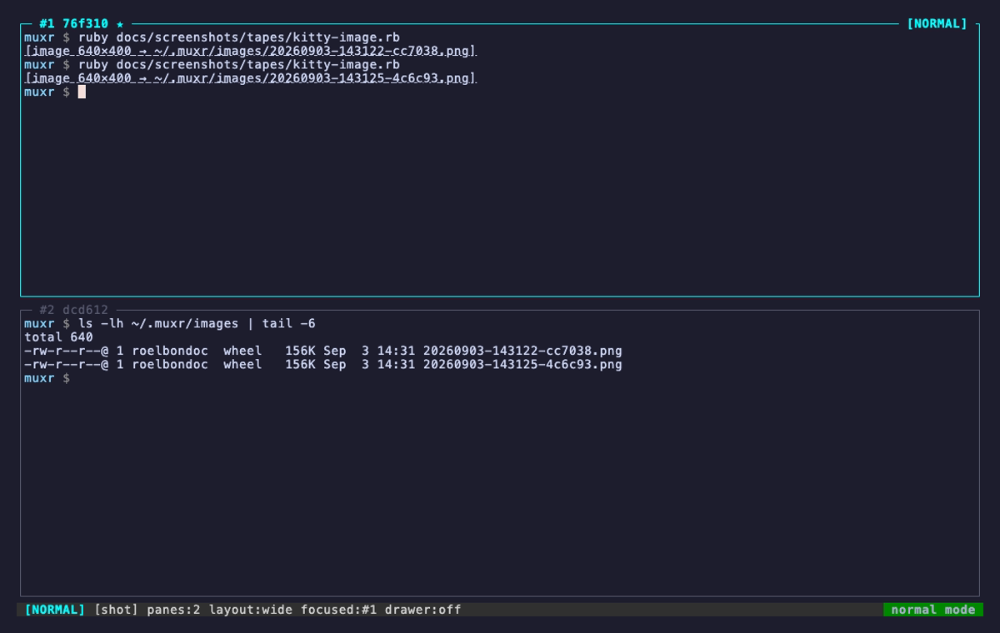

The line carries an OSC 8 `file://` hyperlink, so Cmd-click opens it in your
image viewer. Multi-chunk transmissions are reassembled, raw RGB/RGBA pixel
data is re-encoded into a real PNG container, and the 200 most recent images
are kept. muxr answers the protocol's capability query, so programs that probe
choose kitty over sixel; sixel itself is consumed and discarded rather than
decoded.

## Control surface and MCP

Alongside the TTY socket, each server exposes a control listener at
`~/.muxr/sockets/<name>.ctrl.sock` speaking newline-delimited JSON-RPC:

```
session.get   panes.list   pane.read       pane.send_input  pane.run
pane.focus    pane.new     pane.kill       pane.promote     pane.redraw
pane.subscribe / unsubscribe               pane.mirror / mirror_resize / unmirror
pane.move / move_commit / move_abort       layout.set / layout.cycle
drawer.toggle / show / hide / reset / read / send_input     session.save
```

It accepts many concurrent clients and is independent of TTY attach —
programmatic callers never count as "attached", so an agent and a human can
drive the same session at once.

Two details make automation over it reliable rather than racy:

- **`pane.run` waits for the PTY to go idle** before responding. It sends the
  input, polls for output, and returns once no bytes have arrived for
  `idle_ms` (default 500). Server-side idle detection avoids the
  send-then-poll race that plagues naive client-side automation.
- **Keys are named, not escaped.** `pane.send_input`, `pane.run`, and
  `drawer.send_input` accept a `keys` array of vim-style tokens (`<esc>`,
  `<c-c>`, `<cr>`, arrows) interleaved with literal text, so callers never
  have to remember that Escape is `"\e"`. Bracketed-paste wrapping still
  applies to literal segments only.

### Claude Code integration

```bash
muxr --install-skill     # installs the skill into ~/.claude/skills and
                         # prints the `claude mcp add` registration line
```

`bin/muxr-mcp` is a standalone MCP-over-stdio bridge that turns Claude Code
tool calls into control-socket requests. It exposes the surface above as
`muxr_pane_run`, `muxr_pane_read`, `muxr_layout_set`, `muxr_drawer_*` and
friends, and finds its target session from `MUXR_CONTROL_SOCKET` or
`MUXR_SESSION`.

**Every PTY muxr spawns gets those two vars**, so any `claude` you start from
any pane is wired to the session it is sitting in — no drawer required, and
nothing to configure per pane. Register the bridge once at user scope
(`claude mcp add muxr muxr-mcp --scope user`) and it is simply always there.
A pane's shell also gets `MUXR_PANE`, its own pane id; the bridge refuses
`muxr_pane_read`, `muxr_pane_send_input`, `muxr_pane_run` and
`muxr_pane_kill` aimed at that id, since a claude driving its own pty feeds
its output back to itself. `muxr_pane_focus` and `muxr_pane_promote` are
harmless on yourself and stay allowed.

Because the bridge is registered for *every* claude session, including ones
nowhere near a muxr, it starts whether or not a session is reachable: with no
socket to talk to it completes the MCP handshake, advertises **no** tools, and
explains itself if called anyway. It connects on first use and reconnects on
its own, so a pane's claude survives a `C-a q` and restart of the session
around it.

Those vars are a snapshot of where the pane was when its shell started, and a
pane can be **moved to another session** while that shell keeps running — a
running process's environment can't be rewritten from outside, so the env goes
stale. `MUXR_PANE` is what makes this recoverable: when the session the env
names no longer lists that pane as its own, the bridge asks the other sockets
in the same directory which of them does, and talks to that one instead. It
re-checks on a ten-second TTL, so a pane moved out from under a running claude
is followed rather than leaving it driving its old session. A mirrored pane
carries `origin` and is never mistaken for the real owner.

`C` (normal), `C-a C` (passthrough), or `:claude` opens a drawer whose shell
is `claude`, additionally carrying `MUXR_FOCUSED_PANE` and
`MUXR_DRAWER_SELF=1`. You get a Quake-style Claude Code overlay that already
knows which pane you were looking at. `MUXR_DRAWER_SELF` makes the bridge
refuse `drawer.*` methods, so the drawer cannot recurse into its own PTY —
the drawer's equivalent of `MUXR_PANE`.

How the skill installs depends on where muxr runs from. An **installed gem**
is **copied**, because RubyGems prunes the old versioned directory on upgrade
and a symlink into it would dangle — re-run `muxr --install-skill` after each
`gem update muxr`. A **source checkout** is **symlinked**, so edits to
`SKILL.md` are live in new Claude sessions. Force either with
`--install-skill=copy` or `--install-skill=link`.

### Private panes

`P` (normal), `C-a P` (passthrough), or `:private` flips the private flag on
the focused pane. Private panes are hidden from programmatic callers:
`panes.list` strips their cwd and dimensions, and `pane.read`,
`pane.send_input`, `pane.run`, `pane.subscribe`, and `pane.kill` refuse with
an error pointing the human back at the TTY. They are also never offered in
another session's pane picker.

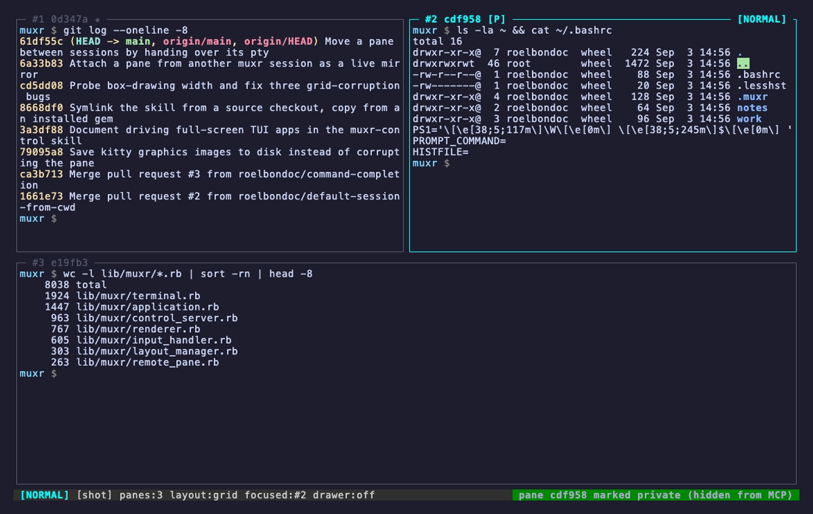

The flag is persisted in the session JSON and shown as `[P]` in the title. The
control surface deliberately has **no method to flip it** — only a human at
the keyboard can make a pane public again.

## Sessions and persistence

`d` / `C-a d` detaches the client and leaves the server running. Reattaching
gives you back the same shells with their full history, because the live
session never left the server process. `q` / `C-a q` / `:quit` flash
`kill session? (y/n)` in the status bar and only tear the server down on `y` —
there is no kill-without-confirm binding, by design.

`:save` writes a structural snapshot to `~/.muxr/sessions/<name>.json`:

```json
{
  "name": "work",
  "layout": "tall",
  "focused_index": 0,
  "master_index": 0,
  "panes": [
    {"id": "a3f9b2", "cwd": "/home/me/code", "private": false},
    {"id": "c2e810", "cwd": "/tmp", "private": true}
  ],
  "drawer": {"visible": true, "cwd": "/home/me/code"}
}
```

That file is a **cold-storage fallback**, not the source of truth. It only
matters once the server is gone (after `q`, or a reboot): relaunching
`muxr <name>` rebuilds the layout and spawns fresh shells in the saved working
directories, keeping the same pane ids and private flags. Shell history inside
those panes is your shell's job, not muxr's.

```
~/.muxr/
 ├─ sessions/<name>.json        structural snapshot written by `:save`
 ├─ sockets/<name>.sock         TTY client listener (auto-managed)
 ├─ sockets/<name>.ctrl.sock    control / MCP listener (auto-managed)
 ├─ images/                     images decoded out of the kitty protocol
 └─ logs/<name>.log             server stdout and stderr
```

## Architecture

muxr runs as **two processes** talking over a Unix domain socket. The server
owns the PTYs and all session state; the client is a thin TTY front-end that
comes and goes across detach and reattach.

```
Client (foreground, owns the TTY)              Server (daemon, owns the PTYs)
 ├─ STDIN raw mode + alternate screen           Application (event loop, lifecycle)
 ├─ SIGWINCH → RESIZE frame                      ├─ Session ─ Window ─ Pane[] ─ Terminal + PTYProcess
 ├─ WidthProbe (DSR-CPR glyph measurement)       │      └─ Drawer ─ Pane
 └─ Protocol                                     ├─ Renderer        – diff-emits ANSI as OUTPUT frames
     ◄── OUTPUT bytes ──── Renderer ◄────────────┤   InputHandler    – normal/passthrough state machine
     ──── INPUT bytes ───► InputHandler          ├─ CommandDispatcher – ":"-prefixed commands
     ──── HELLO/RESIZE ──► apply_size            ├─ LayoutManager    – pure (layout, count, area) → [Rect]
     ◄── BYE ───────────── disconnect_client     ├─ UNIXServer (TTY socket, one client at a time)
                                                 └─ UNIXServer (.ctrl.sock, many NDJSON clients)
```

Frames are length-prefixed — `[1-byte type][4-byte BE length][payload]` —
with types `H` hello, `I` input, `R` resize, `B` bye, `O` output. The HELLO
payload carries the terminal size plus the width-probe verdict.

The event loop is a single-threaded `IO.select` over both listeners, the
attached client, every pane PTY, the drawer PTY, and every connected control
client. The only off-main-thread work is the foreground-command poller. The
renderer diffs each composed frame against the last and emits only the cells
that changed, so a busy pane costs a handful of bytes per tick rather than a
full repaint — and when no client is attached, rendering is skipped entirely
while PTY data is still drained, so grids stay current for the next attach.

## Development

```bash
bundle install                                     # minitest and rake only
rake test                                          # full suite

ruby -Ilib -Itest test/test_layout_manager.rb      # one file
ruby -Ilib -Itest test/test_terminal.rb -n test_csi_cursor_position
```

The suite is 500+ tests covering the layout algorithms (including spatial
neighbour lookup), the input-handler state machine, the drawer, window pane
ordering, session JSON round-trips, the client/server framing protocol, the
control server and MCP bridge, pane mirroring and fd handoff, the width probe,
the renderer's diff-emit, scrollback storage, and the VT100 emulator's cursor
movement, SGR, erase, scroll-region, autowrap, alternate-screen, and snapshot
round-trip behaviour.
PTY-spawning code paths are dependency-injected, so tests never spawn a shell.

### Regenerating the screenshots

Every image in this README is produced by [`vhs`](https://github.com/charmbracelet/vhs)
driving muxr itself — one `.tape` file per screenshot under
`docs/screenshots/tapes/`:

```bash
brew install vhs                       # one-time
docs/screenshots/tapes/regenerate.sh   # re-renders everything
```

Each tape spawns a throwaway `shot` session, populates panes with real output,
drives the feature being shown, and writes a single PNG. Tapes whose names
start with `_` are shared fragments pulled in with `Source`.

## Contributing

Contributions are welcome from anyone, with one requirement: **the code must
be generated by a frontier LLM** (Claude, GPT, Gemini at their current
top-tier model). Hand-written patches will not be accepted.

When you open a PR, please:

- State which model produced the change.
- Include the prompt(s) you used, or a short summary of the conversation that
  produced the diff.
- Drive the model yourself — review, push back, iterate. You are responsible
  for the patch: it should pass `rake test`, follow the conventions in
  `CLAUDE.md`, and not regress existing behaviour.

Bug reports, feature requests, and design discussion in issues are welcome
regardless of how they are written.

## License

MIT — see [LICENSE.txt](LICENSE.txt).
